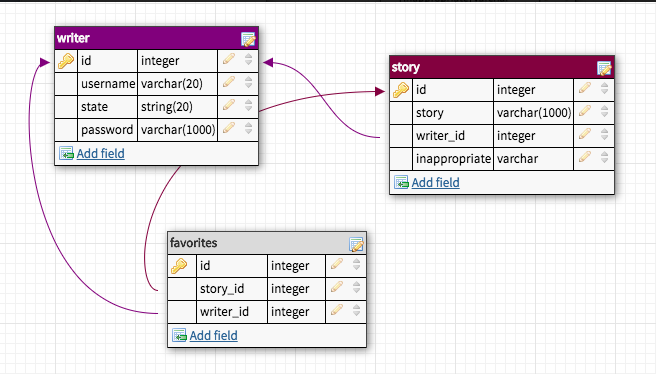

##GOOD DEEDS ANONYMOUS

#Application Purpose:

A little emotional uplift! There are good people, living among us, doing good deeds for others simply because they can. And they are us! Not looking for credit, not looking for the limelight,  simply wanting share our stories. We can do that on Good Deeds Anonymous. By sharing our stories and reading those of others, we can create a quiet feedback loop that benefits ourselves, others, and the communities we share.

#Application Overview:

Good Deeds Anonymous (GDA) is a Single Page Application promoting the creation and reading of Stories describing a good deed done, sorted by State (USA).

Each Story is a piece of user-generated content from a Writer, a registered/logged-in user. All visitors to the site are Readers. Stories are sorted by each Writer’s State of Residence. In a subsequent update, an Admin role will be added for the purpose of removing Stories flagged as inappropriate by registered users.

#Views/Features:

Read (not logged in):
The Read view is the Landing page/Home page of Good Deeds Anonymous. The first story is a simple introduction to the site, its purpose, and its functionality. All visitors are Readers. Readers can go scroll through all the stories. All visitors are encouraged to become Writers via the Sign-in button in the navigation bar. 

#Sign-in:
The Sign-in view allows a visitor to register as a Writer or, if already a Writer, they can login. The Read button remains active, so the user go back if they decide not to registration or login. If a registration or login is submitted and is successful, the Write view displays.

#Write:
The Write view allows a Writer to type and Share a Story. Upon clicking Publish, a prompt is displayed letting the user know their story will be displayed on the Read and Archive pages.

#Read (logged in):
The Read view is always accessible for a logged-in Writer. Unlike a Reader, a Writer can mark Stories as Favorites.

#My Archive:
The My Archive view displays two lists: a list of the Writer’s published stories, which allows them to Edit or Delete Stories, and a list of the Writer’s Favorites, which allows them to unfavorite an item, which removes it from their Favorites list.

#Routes:
Registration/Login
GET all for Read view sorted by most recent
POST for new Story from Write view
UPDATE for adding Favorites
UPDATE for removing Favorites
GET my stories (logged in user)
GET specific story by id
UPDATE for displaying and editing a published Story in Write view
DELETE for deleting a Story

#For next iteration:

~Writers will be able to flag Stories as inappropriate, alerting an Admin to decide whether or not to delete the offending Story. An Admin view will be added to the Archive page at that time.
~Writers will be able to update their state of residence; story can be sorted by state.
	~use location service to sort with distance of place story added from
~Make mobile version
~Add social sharing (Facebook, Instagram, Twitter...)

#Entity Relationship Diagram:



#Technologies used:
React
Redux
Material UI
Node
Express
Passport
PostgreSQL
Heroku

## Prerequisites

Before you get started, make sure you have the following software installed on your computer:

- [Node.js](https://nodejs.org/en/)
- [PostrgeSQL](https://www.postgresql.org/)
- [Nodemon](https://nodemon.io/)

## Create database and table

Create a new database called `good_deeds` and create:

```SQL
CREATE TABLE writer (
    id SERIAL PRIMARY KEY,
    username VARCHAR (80) UNIQUE NOT NULL,
    password VARCHAR (1000) NOT NULL,
    state_usa VARCHAR (80) NOT NULL
);

CREATE TABLE story (
	id SERIAL PRIMARY KEY,
	story VARCHAR (1000) NOT NULL,
	writer_id integer REFERENCES writer NOT NULL,
	inappropriate VARCHAR (20) NOT NULL
);

CREATE TABLE favorite (
	id SERIAL PRIMARY KEY,
	story_id integer REFERENCES story UNIQUE NOT NULL,
	writer_id integer REFERENCES writer UNIQUE NOT NULL
);
```
## Development Setup Instructions

* Run `npm install`
* Start postgres if not running already (`brew services start postgresql`)
* Run `npm run client`
* Run `npm run server`
* Navigate to `localhost:3000`

## Production Build

This is the build Heroku will run, but during development, you will likely not need to use it.

* Start postgres if not running already by using `brew services start postgresql`
* Run `npm start`
* Navigate to `localhost:5000`

## Lay of the Land

* `src/` contains the React application
* `public/` contains static assets for the client-side
* `build/` after you build the project, contains the transpiled code from `src/` and `public/` that will be viewed on the production site
* `server/` contains the Express App
